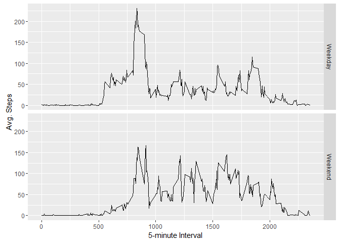

Background
----------

The purpose of this script or recipe is to complete the analysis of
activity monitoring data. This data was collected leveraging a device
that collects information in 5 minute intervals. This data was tracked
over two months for an anonymour individuals during the months of
October and November, 2012. A link to the data is provided below, as
well as a desciption of the variables in the data set.

### Data Found Here

-   **Dataset**: [Activity
    Data](https://d396qusza40orc.cloudfront.net/repdata%2Fdata%2Factivity.zip)
    \[52K\]

### Data Variables

-   **steps**: The number of steps taken during a 5-minute interval;
    missing values = `NA`

-   **date**: the date on which the measurement was taken: YYYY-MM-DD
    format

-   **interval**: Identifier for the 5-minute interval in which
    measurement was taken

### Load Data

    ### Load Data
    activity <- read.csv("D:/data/data/activity.csv", stringsAsFactors=FALSE)

Let's take a looked at the data now that is is loaded

**First**: Examine First 5 Observations

    ### Examine Head
    head(activity, n=5)

    ##   steps       date interval
    ## 1    NA 2012-10-01        0
    ## 2    NA 2012-10-01        5
    ## 3    NA 2012-10-01       10
    ## 4    NA 2012-10-01       15
    ## 5    NA 2012-10-01       20

**Second**: Examine Last 5 Observations

    ### Examine Head
    tail(activity, n=5)

    ##       steps       date interval
    ## 17564    NA 2012-11-30     2335
    ## 17565    NA 2012-11-30     2340
    ## 17566    NA 2012-11-30     2345
    ## 17567    NA 2012-11-30     2350
    ## 17568    NA 2012-11-30     2355

Notice the 'NA' values in the data. Let's take a look at how many there
are in the data.

**Third**: Check a Summary of the data.

    ### Examine Summary of the Data
    summary(activity)

    ##      steps            date              interval     
    ##  Min.   :  0.00   Length:17568       Min.   :   0.0  
    ##  1st Qu.:  0.00   Class :character   1st Qu.: 588.8  
    ##  Median :  0.00   Mode  :character   Median :1177.5  
    ##  Mean   : 37.38                      Mean   :1177.5  
    ##  3rd Qu.: 12.00                      3rd Qu.:1766.2  
    ##  Max.   :806.00                      Max.   :2355.0  
    ##  NA's   :2304

**Fourth**: Check the Dimensions of the Data.

    ### Examine Summary of the Data
    dim(activity)

    ## [1] 17568     3

The `steps` variable shows mean of 37.38, a maximum of 806, and a
minimum of 0. Of the 17,568 observations in the dataset, 2,304 are
missing. This represents 13.11% of all observations in the dataset.

What is the mean total number of steps taken per day?
=====================================================

Objectives
----------

-   Make a histogram of the total number of steps taken each day.
-   Calculate and report the mean and median total number of steps taken
    per day.

#### Ramp Up and Histogram Code

    ### Load to dplyr to leverage power of summarise function, take advantage of
    ### magrittr package to make code more readable.
    library(dplyr)
    steps.per.day <- activity %>% group_by(date) %>% summarise(total = sum(steps, na.rm = T))

    ### Calculate the mean steps per day
    mean.steps.per.day <- mean(steps.per.day$total)
    mean.steps.per.day

    ## [1] 9354.23

    ### Calculate the median steps per day
    median.steps.per.day <- median(steps.per.day$total)
    median.steps.per.day

    ## [1] 10395

    ### Load ggplot2 to generate breaktaking stunning visuals
    library(ggplot2)

    ### Use geom_histogram to generate plot
    ggplot(steps.per.day, aes(x = total)) +
            geom_histogram(fill = "green", colour = "black") +
            geom_vline(xintercept = mean.steps.per.day, color = "red", linetype = "dashed", size = 1) + 
            geom_vline(xintercept = median.steps.per.day, color = "blue", linetype = "dashed", size = 1) +
            labs(title = "Histogram - Total Steps A Day")

### Analysis

The mean (denoted by dashed RED line) `steps` per day was *9354* for the
time period of October 2012 and November 2012, while the median (denoted
by dashed BLUE line) `steps` was *10395* over the same time. The
histogram shows a high proportion of zero steps, this can easily be
explained by someone potentially forgetting to put on the fitness
tracker.

What is the daily activity pattern?
===================================

Objectives
----------

-   Make a time series plot (i.e. \`type = "1") of the 5-minute
    interval (x-axis) and the average number of steps taken, averaged
    across all days (y-axis).
-   Which 5-minute interval, on average, across all the days is the
    dataset, contains the maximum number of steps?

<!-- -->

    ### Leverage dplyr and magrittr packages to generate the average number of steps taken
    ### across all days for each 5-minute interval
    avg.steps.per.int <- activity %>% group_by(interval) %>% summarise(avg.int = mean(steps, na.rm = T))

    ### Identify the Maximum average for the 5-minute interval. This interval will show
    ### which has the most activity, on average on any given day. Leverage which() function
    ### to identify the index at which avg.int is equal to the max avg.int
    max.steps.int <- which(avg.steps.per.int$avg.int == max(avg.steps.per.int$avg.int))

    ### Pushing this index forward to indentify the interval at which this occurs, we leverage
    ### brackets to pull the approriate result to the forefront.
    max.steps.inv <- avg.steps.per.int[max.steps.int, 1]

    ggplot(avg.steps.per.int, aes(x = interval, y = avg.int)) +
            geom_line() +
            xlab("5-minute Interval") +
            ylab("Avg. Steps")

### Analysis

The highest 5-minutes interval `steps` average across all days is
206.17.

Imputing Missing Values
=======================

Objectives
----------

-   Calculate and report the total number of missing values in the
    dataset (i.e. the total number of rows with NA's).

<!-- -->

    activity.missing <- is.na(activity$steps)
    table(activity.missing)

    ## activity.missing
    ## FALSE  TRUE 
    ## 15264  2304

-   Devise a strategy for filling in all of the missing values in
    the dataset. The strategy does not need to be sophisticated. For
    example, you could use the mean/median for that day, or the mean for
    that 5-minute interval, etc.
-   Create a new dataset that is equal to the original dataset but with
    the missing data filled in.

<!-- -->

    ### Copy Original Dataset
    filled.in.activity <- activity

    ### Iterate over the copied dataset to replace the missing values "NA" with the
    ### mean within hour. Median could also be used.
    for (x in 1:nrow(filled.in.activity)) {
        ### if data is na, then complete these steps in the algorithm
        if (is.na(filled.in.activity[x, "steps"])) {
            ### Identify - for given x grab the interval that needs replaced
            interval.miss <- filled.in.activity[x, "interval"]
            ### Index - Match the Missing Interval with Appropriate Interval from avg.steps.per.int
            interval.miss.x <- which(avg.steps.per.int[, "interval"] == interval.miss)
            ### Exploit - Exploit the Index to populate the appropriate Mean
            steps.miss.mean <- avg.steps.per.int[interval.miss.x, "avg.int"]
            ### Execute - Populate the Mean to the dataset
            filled.in.activity[x, "steps"] <- steps.miss.mean
        }
    }

    ### Check the dataset to see if all NA's have been removed
    (nrow(filled.in.activity) - sum(complete.cases(filled.in.activity))) == 0

    ## [1] TRUE

-   Make a histogram of the total number of steps taken each day and
    Calculate and report the mean and median total number of steps taken
    per day. Do these values differ from the estimates from the first
    part of the assignment? What is the impact of imputing missing data
    on the estimates of the total daily number of steps?

<!-- -->

    ### Load to dplyr to leverage power of summarise function, take advantage of
    ### magrittr package to make code more readable.
    library(dplyr)
    steps.per.day.filled <- filled.in.activity %>% group_by(date) %>% summarise(total = sum(steps, na.rm = T))

    ### Calculate the mean steps per day
    mean.steps.per.day.filled <- mean(steps.per.day.filled$total)
    mean.steps.per.day.filled

    ## [1] 10766.19

    ### Calculate the median steps per day
    median.steps.per.day.filled <- median(steps.per.day.filled$total)
    median.steps.per.day.filled

    ## [1] 10766.19

    ### Use geom_histogram to generate plot
    ggplot(steps.per.day.filled, aes(x = total)) +
            geom_histogram(fill = "green", colour = "black") +
            geom_vline(xintercept = mean.steps.per.day.filled, color = "red", linetype = "dashed", size = 1) + 
            geom_vline(xintercept = median.steps.per.day.filled, color = "blue", linetype = "dashed", size = 1) +
            labs(title = "Histogram - Total Steps A Day - Data Filled")

### Analysis

The median of **1.076618910^{4}** and the mean of **1.076618910^{4}**
are identical since we imputed the missing value with the mean. The
distribution looks somewhat normal. There are period of no activity and
extreme activity, this can coincide with the sleeping and working
patterns of humans.

Are there differences in activity patterns between weekdays and weekends?
=========================================================================

Objectives
----------

-   Create a new factor variable in the dataset with two levels -
    "weekday" and "weekend" indicating whether a given date is a weekday
    or weekend day.

<!-- -->

    ### Create a function to evaluate whether or not the date is a weekend
    day.eval <- function(date) {
        day <- weekdays(date)
        if (day %in% c("Monday", "Tuesday", "Wednesday", "Thursday", "Friday"))
            return("Weekday")
        else if (day %in% c("Saturday", "Sunday"))
            return("Weekend")
        else
            stop("invalid date")
    }

    filled.in.activity$date <- as.Date(filled.in.activity$date)
    filled.in.activity$day.category <- sapply(filled.in.activity$date, FUN = day.eval)

    ### Examine to see if this code worked properly.
    head(filled.in.activity, n=10)

    ##        steps       date interval day.category
    ## 1  1.7169811 2012-10-01        0      Weekday
    ## 2  0.3396226 2012-10-01        5      Weekday
    ## 3  0.1320755 2012-10-01       10      Weekday
    ## 4  0.1509434 2012-10-01       15      Weekday
    ## 5  0.0754717 2012-10-01       20      Weekday
    ## 6  2.0943396 2012-10-01       25      Weekday
    ## 7  0.5283019 2012-10-01       30      Weekday
    ## 8  0.8679245 2012-10-01       35      Weekday
    ## 9  0.0000000 2012-10-01       40      Weekday
    ## 10 1.4716981 2012-10-01       45      Weekday

-   Make a panel plot containing a time series plot (i.e. type = "l") of
    the 5-minute interval (x-axis) and the average number of steps
    taken, averaged across all weekday days or weekend days (y-axis).
    See the README file in the GitHub repository to see an example of
    what this plot should look like using simulated data.

<!-- -->

    ### Summarise data
    filled.summary.data <- filled.in.activity %>% group_by(interval, day.category) %>% 
        summarise(avg.steps = mean(steps))

    ### Examine the head of the function to see if it worked properly.
    head(filled.summary.data, n=5)

    ## Source: local data frame [5 x 3]
    ## Groups: interval [3]
    ## 
    ##   interval day.category  avg.steps
    ##      <int>        <chr>      <dbl>
    ## 1        0      Weekday 2.25115304
    ## 2        0      Weekend 0.21462264
    ## 3        5      Weekday 0.44528302
    ## 4        5      Weekend 0.04245283
    ## 5       10      Weekday 0.17316562

    ggplot(filled.summary.data, aes(x = interval, y = avg.steps)) +
            geom_line() +
            xlab("5-minute Interval") +
            ylab("Avg. Steps") +
            facet_grid(day.category~.)

### Analysis

Weekdays appear to have higher peaks, which probably correspond to a
person traveling to work, whereas they may not leave home on the
weekends. The average per 5 minute interval appears higher on the
weekend might be the result of people being more active during their
time off than sitting in their office.
